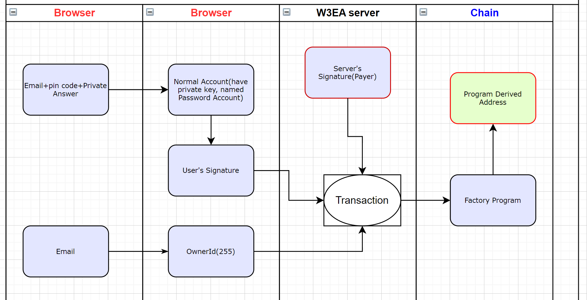

# Web3EasyAccess

Welcome to: [web3easyaccess.link](https://www.web3easyaccess.link/)

## What is Web3EasyAccess

Web3EasyAccess: Provides an easy way to access the web3 world. People can log in to this website just like a regular Web2 website and then manage decentralized assets and explore the decentralized world.\
In Solana, we leverage off-chain multi-signature and Program Derived Addresses to implement our system. With our service, users don't need to manage mnemonic phrases or private keys. Instead, they control their accounts using their own passwords, while still maintaining the core feature of decentralization. Additionally, users can modify their existing password information without changing their account addresses.

## System implementation principle

### Background knowledge: What is PDA

-   Program Derived Addresses (PDAs) are home to accounts that are designed to be controlled by a specific program. With PDAs, programs can programmatically sign for certain addresses without needing a private key.
-   In this system, the account used to store a user's assets is a Program-Derived Address (PDA). Each PDA has a unique signing public key that corresponds to the user's custom password. Every transaction requires the user to complete an off-chain signature before it can be executed.

### System working principle

#### Create account and Submit a transaction

Referring to the diagram, each transaction demands two signatures: one from the user's private signing account on the browser and another from our server's built-in signing account. To preserve decentralization, the user's private account is generated using their password and is never shared with the server. A downside to this approach is that a lost password cannot be recovered.

The system's primary processing logic consists of the following points:

1. First, a regular wallet address, termed "password address" or "password account", is derived from the user's email and password to control the user's PDA. This address is not disclosed to the user and is used to sign transactions on the browser side. Transactions without this signature cannot be executed. Multiple funding accounts under the same email share a single "password address".

2. Second, an ownerId is derived from the user's email. Currently, up to 255 ownerIds are supported. The system creates a separate funding account (PDA) for each ownerId.

3. Third, on the application server backend, the system has an independent regular wallet address that also signs user transactions and acts as the payer for on-chain transaction fees. Within the Solana program, when executing a transaction, the required fees are refunded from the user's asset PDA to the backend wallet address.

### A decentralized understanding of password information

1. This system preserves the core attribute of blockchain technology: decentralization. This means that the system does not maintain a centralized database of users' private information. Consequently, if a user forgets their password, they will permanently lose access to their account. However, a future account guardianship feature will allow users to designate trusted individuals, such as friends or family, to regain control of the account.
2. User email addresses cannot be used for password recovery.

### What is the payment method for Transaction network fees

-   The fee for each transaction is calculated automatically by the system and included as a parameter in the user contract. The fee is deducted from the user's account upon transaction execution.

